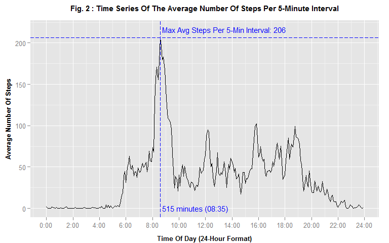
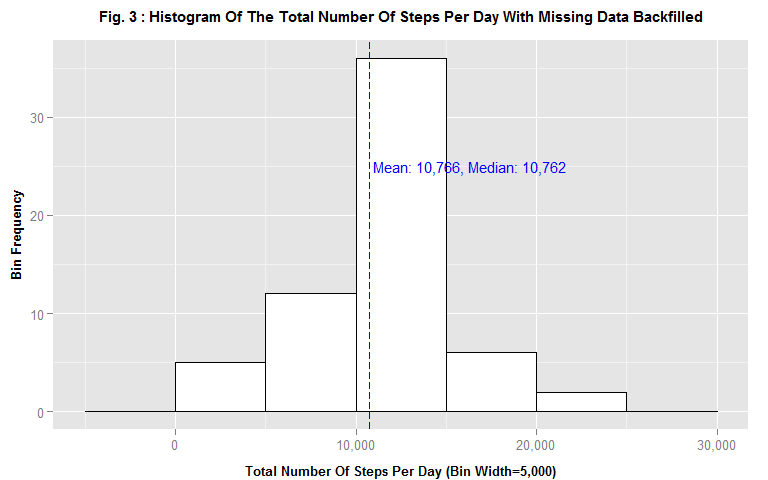

# Reproducible Research: Peer Assessment 1


The following R packages are required for the analysis:


```r
require(data.table) # fread
require(lubridate) # date and time operations
require(dplyr) # filtering, mutating, grouping, and summarizing
require(ggplot2) # Plotting
require(scales) # Axis labels formatters
```

## Data Loading and Preprocessing

### Loading


The data is read from the file 'activity.csv', which is assumed to be in the current working directory. The data is read with the `fread` function from the `data.table` package.


```r
if (!file.exists(filename)) {
    stop(paste("The file '", filename, "' cannot be found!"))        
}
data <- fread(filename)
```


The loaded data contains 17,568 observations and 3 variables.

### Pre-processing

The `date` variable is converted to the POSIXct date data type using the `ymd` function in the `lubridate` package.


```r
data <- transform(data, date = ymd(date))
```

## Histogram of Total Number of Steps Taken per Day

### Data Processing

The mean and median of the total number of steps taken per day are calculated as follows, using the `dplyr` package:

1. The observations with missing number of steps are removed from the raw data with the `!is.na(steps)` filter;
1. The filtered data is grouped by the `date` column;
1. The grouped data is summarized with the `sum` function into the `steps_total` column;
1. The `mean` and `median` functions are executed on the `steps_total` column to compute the mean and median respectively. 


```r
data_grouped_by_date <- 
    data %>%
    filter(!is.na(steps)) %>%
    group_by(date) %>% 
    summarize(steps_total = sum(steps))    
steps_mean <- mean(data_grouped_by_date$steps_total)
steps_mean_formatted <- format(round(steps_mean), big.mark=",") 
steps_median <- median(data_grouped_by_date$steps_total)
steps_median_formatted <- format(round(steps_median), big.mark=",") 
```

The rounded calculated mean and median of the total number of steps per day are **10,766** and **10,765** respectively.


### Figure 1: Histogram of Total of Steps per Day

Figure 1 plots the histogram of the total number of steps per day with the `ggplot2` function `geom_histogram`.


```r
plotStepsHistogram <- function(title, bin_width) {
    # Plot's annotations
    annotations <- data.frame(
        x = c(steps_mean + 200), # +200 to move the annotation to the right of the vertical line a bit
        y = c(25), 
        label = c(sprintf("Mean: %s, Median: %s", 
                          steps_mean_formatted, 
                          steps_median_formatted))
        )    
    # Plot
    plot <- 
        ggplot(data=data_grouped_by_date, aes(steps_total)) + 
        geom_histogram(binwidth=bin_width, fill="white", colour="black") +
        theme(
            plot.title = element_text(size=11, face="bold", vjust=2), # Move the title label up a bit
            axis.title.x = element_text(size=10, face="bold", vjust=-0.5), # Move the x axis label down a bit
            axis.title.y = element_text(size=10, face="bold", vjust=1) # Move the y axis label left a bit
            ) +
        labs(x = paste0('Total Number of Steps per Day (Bin width=', bin_width, ')'), 
             y = 'Bin Frequency',
             title = title
             ) +
        scale_x_continuous(label = comma) +
        geom_vline(xintercept = steps_mean, colour="blue", linetype = "longdash") +
        geom_text(data = annotations, aes(x = x, y = y, label = label), col = "blue", hjust = 0, size = 4)
    print(plot)
}

plotStepsHistogram(title = paste('Fig.', fig_num, ': Histogram of the total number of steps per day'), bin_width = 5000)
```

 

## Average Daily Activity Pattern

### Data Processing

1. The observations with missing number of steps are removed from the raw data with the `!is.na(steps)` filter;
1. The columns `interval_minutes` and `interval_minutes_formatted` are created to contain for each interval value the corresponding total number of minutes in the day as a numeric and formatted character array ('hh:mm') respectively.
1. The filtered data is grouped by the `interval_minutes` and `interval_minutes_formatted` columns;
1. The grouped data is summarized with the `mean` function into the `steps_avg` column;
1. The maximum average number of steps per interval is obtained by sorting the summarized data by the `steps_avg` column, descending, and retrieving the top row with the `head` function.
1. The time series is plotted with the `ggplot2` `geom_line` function.


```r
# Helper function: Converts the raw 'interval' to the total number of minutes in the day.
as.minutes <- function(interval) {
     interval_char <- sprintf("%04d", interval)
     60 * as.integer(substr(interval_char, 0, 2)) + as.integer(substr(interval_char, 3, 4))    
}

# Helper function: Formats the raw 'interval' numeric as a 'hh:mm' character vector.
formatInterval <- function(interval) {
    interval_char <- sprintf("%04d", interval)
    sprintf('%s:%02s', substr(interval_char, 0, 2), substr(interval_char, 3, 4))
}

data_grouped_by_interval <-  
    data %>%
    # Remove the missing data
    filter(!is.na(steps)) %>%    
    # Create a interval_minutes column to represent the interval's number of minutes in the day
    mutate(interval_minutes = as.minutes(interval)) %>%
    # create a interval_minutes_formatted to be used for the x-axis ticks.    
    mutate(interval_minutes_formatted = formatInterval(interval)) %>%
    # Group by interval
    group_by(interval_minutes, interval_minutes_formatted) %>%     
    # Summarize the groups by mean
    summarize(steps_avg = mean(steps))    
data_ordered <- ungroup(data_grouped_by_interval) %>% arrange(desc(steps_avg))
steps_avg_max <- head(data_ordered, 1)
steps_avg_max_formatted <- format(round(steps_avg_max$steps_avg), big.mark=",")
steps_avg_max_interval_to <- steps_avg_max$interval_minutes_formatted
```

The maximum average number of steps per interval is **206** steps, which occurs at the **08:35** interval.


### Figure 2: Average Number of Steps In A Day

Figure 2 plots the time series of the 5-minute interval (x-axis) and the average number of steps taken, averaged across all days (y-axis).


```r
# Helper function: Formats a total number of minutes in the day as 'hh:mm'
formatIntervalAsHoursAndMinutes <- function(total_minutes) {
    hour <- floor(total_minutes / 60)
    minute <- total_minutes - 60 * hour
    sprintf('%d:%02d', hour, minute)    
}

# Plot's annotations
annotations <- data.frame(
    x = c(steps_avg_max$interval_minutes + 10, steps_avg_max$interval_minutes + 10), 
    y = c(steps_avg_max$steps_avg + 10, 0), 
    label = c(
        sprintf("Max Avg Steps: %s", format(round(steps_avg_max$steps_avg), big.mark=",")),
        sprintf("%d minutes (%s)", 
                steps_avg_max$interval_minutes, 
                steps_avg_max_interval_to)
        )
    )    
# Plot
plot <- 
    ggplot(data_grouped_by_interval, aes(interval_minutes, steps_avg)) +
    geom_line() +
    theme(
            plot.title = element_text(size=12, face="bold", vjust=2),
            axis.title.x = element_text(size=10, face="bold", vjust=-0.5),
            axis.title.y = element_text(size=10, face="bold", vjust=1)
        ) +
    labs(x = 'Time of Day (24 Hour Format)', 
         y = 'Average Number of Steps',
         title = paste('Fig.', fig_num, ': Time series of the average number of steps per 5-minute interval')
         ) +
    scale_x_continuous(breaks=c(0, 8*60, 16*60, 23*60+59), label = formatIntervalAsHoursAndMinutes) +    
    geom_vline(xintercept = steps_avg_max$interval_minutes, colour="blue", linetype = "longdash") +
    geom_hline(yintercept = steps_avg_max$steps_avg, colour="blue", linetype = "longdash") +
    geom_text(data = annotations, aes(x = x, y = y, label = label), col = "blue", hjust = 0, size = 4)   
print(plot)
```

 

## Imputing Missing Values

### Count of Rows Missing Data


```r
# Count the number of rows with missing number of steps
steps_na_count <- sum(is.na(data$steps))
steps_na_count_formatted <- format(steps_na_count, big.mark=",")
```

**2,304** rows have a missing number of steps `steps` variable value.

### Data Processing: Missing Data Backfill Strategy

The chosen strategy to input, or backfill, missing data is the following: For any given observation (row) with a missing number of steps, the missing value is set to the mean number of steps for the row's interval across all days in the data set. The corresponding processing steps go as follows:

1. Create a table of the steps means for all intervals;
1. perform a "left join" with `dplyr` between the original data and the steps means table calculated above. Note that the join associates each row with its corresponding interval's steps mean regardless of whether the number of steps is missing or not;
1. Create a new colum in the resulting table called `steps_filled` to be the value of `steps` if it is avaible (i.e., not missing), or the interval's steps mean otherwise (i.e., missing);
1. Group the resulting table by `date`;
1. Summarize by summing the `steps_filled` columns.


```r
# Calculate the 5-minute interval means 
data_grouped_by_interval <- 
    # Group the data (with NA removed) by interval
    data %>%
    filter(!is.na(steps)) %>%
    group_by(interval) %>% 
    # Summarize by 'mean'
    summarize(steps_avg = round(mean(steps)))

# Left-join data with data_grouped_by_interval in order to associate
# each observation with its corresponding interval's mean number of steps.
data_filled <-  
    data %>%
    left_join (data_grouped_by_interval, by=c('interval')) %>%
    arrange(date) %>%
    # Add a new column with the NAs filled with the average
    mutate(steps_filled=ifelse(is.na(steps), steps_avg, steps))

# Group by date, and summarize by summing 'steps_filled'
data_grouped_by_date <- 
    data_filled %>%
    group_by(date) %>% 
    summarize(steps_total = sum(steps_filled))
        
steps_mean <- mean(data_grouped_by_date$steps_total)
steps_mean_formatted <- format(round(steps_mean), big.mark=",") 
steps_median <- median(data_grouped_by_date$steps_total)
steps_median_formatted <- format(round(steps_median), big.mark=",") 
```

With the missing data backfilled, the rounded calculated mean and median of the total number of steps per day are **10,766** and **10,762** respectively. By the mathematical nature of the backfilling strategy, the new mean is expected to be unchanged. However, with the addition of data points, the median is expected to move a little.


### Figure 3: Histogram of Total of Steps per Day (With Missing Data Backfilled)


```r
plotStepsHistogram(title = paste('Fig.', fig_num, ': Histogram of the total number of steps per day with Missing Data Backfilled'), bin_width = 5000)
```

 

## Weekdays vs. Weekends Activity Patterns


