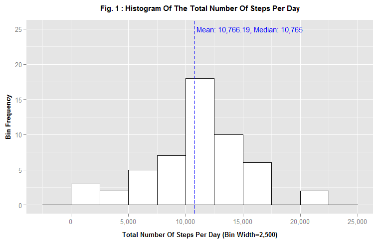

# Reproducible Research: Peer Assessment 1


## Content

This report provides an analysis of the foot steps (walking, running, etc.) taken by an anonymous individual over a period of two months (October and November 2012.) Such so-called "personal activity" steps data was collected from a monitoring device such as a smart phone at 5-minute intervals throughout the day.

The analysis produces the following:

1. A histogram of the total number of steps per day;
1. The mean and median of the total number of steps per day;
1. A time series plot of the mean number of steps per 5-minute interval over the course of a day;
1. A strategy to impute missing data;
1. The previous time series re-visited with the missing data imputed;
1. A comparison of the steps activity patterns in weekdays vs. weekend days.

## Data Loading and Preprocessing

### Tools and R Packages

The analyis uses R to perform all data processing and plotting. The following R packages are required for the analysis:


```r
require(data.table) # fread
require(lubridate) # date and time operations
require(dplyr) # filtering, mutating, grouping, and summarizing
require(ggplot2) # Plotting
require(scales) # Axis labels formatters
```

### Loading


```r
filename <- 'activity.csv'
```

The data is read from the file 'activity.csv', which is assumed to be in the current working directory. The data is read with the `fread` function from the `data.table` package.


```r
if (!file.exists(filename)) {
    stop(paste("The file '", filename, "' cannot be found!"))        
}
data <- fread(filename)
```


The loaded data contains **17,568** observations across **3** variables: **steps, date, interval**.

### Pre-processing

The `date` variable is converted to the POSIXct date data type using the `ymd` function in the `lubridate` package.


```r
data <- transform(data, date = ymd(date))
```

## Histogram of Total Number of Steps Taken per Day

### Data Processing

The mean and median of the total number of steps taken per day are calculated as follows, using the `dplyr` package:

1. The observations with missing number of steps are removed from the raw data with the `!is.na(steps)` filter;
1. The filtered data is grouped by the `date` column;
1. The grouped data is summarized with the `sum` function into the `steps_total` column;
1. The `mean` and `median` functions are executed on the `steps_total` column to compute the mean and median respectively. 


```r
data_grouped_by_date <- 
    data %>%
    filter(!is.na(steps)) %>% # Remove missing data
    group_by(date) %>% # Group by date
    summarize(steps_total = sum(steps)) # Sum the total number of steps per day
steps_mean <- mean(data_grouped_by_date$steps_total)
steps_mean_formatted <- format(round(steps_mean, 2), big.mark=",") # Rounded and formatted with a comma
steps_median <- median(data_grouped_by_date$steps_total)
steps_median_formatted <- format(round(steps_median, 2), big.mark=",") # Rounded and formatted with a comma

# Remember the mean and median with missing data removed
steps_mean_no_na_formatted <- steps_mean_formatted
steps_median_no_na_formatted <- steps_median_formatted
```

The mean and median (rounded to 2 decimals) of the total number of steps per day are **10,766.19** and **10,765** respectively.


### Histogram of Total of Steps per Day

Figure 1 plots the histogram of the total number of steps per day with the `ggplot2` function `geom_histogram`.


```r
# An R function is created so that the histogram can be plotted again with missing values imputed (Later in the report)
# Arguments:
# title: Title of the plot.
# bin_width: Histogram's bin width.
plotStepsHistogram <- function(title, bin_width) {
    # Plot's annotations to display the mean and median
    annotations <- data.frame(
        x = c(steps_mean + 200), # +200 to move the annotation to the right of the vertical line a bit
        y = c(25), 
        label = c(sprintf("Mean: %s, Median: %s", 
                          steps_mean_formatted, 
                          steps_median_formatted))
        )    
    # Plot
    plot <- 
        ggplot(data=data_grouped_by_date, aes(steps_total)) + 
        geom_histogram(binwidth=bin_width, fill="white", colour="black") +
        theme(
            plot.title = element_text(size=11, face="bold", vjust=2), # Move the title label up a bit
            axis.title.x = element_text(size=10, face="bold", vjust=-0.5), # Move the x axis label down a bit
            axis.title.y = element_text(size=10, face="bold", vjust=1) # Move the y axis label left a bit
            ) +
        labs(x = paste0('Total Number Of Steps Per Day (Bin Width=', format(bin_width, big.mark=","), ')'), 
             y = 'Bin Frequency',
             title = title
             ) +
        scale_x_continuous(label = comma) +
        geom_vline(xintercept = steps_mean, colour="blue", linetype = "longdash") +
        geom_text(data = annotations, aes(x = x, y = y, label = label), col = "blue", hjust = 0, size = 4)
    print(plot)
}

# Call the function to plot the histogram
plotStepsHistogram(title = paste('Fig.', fig_num, ': Histogram Of The Total Number Of Steps Per Day'), bin_width = 2500)
```

 

## Average Daily Activity Pattern


### Data Processing

The following data processing is executed in order to analyze the average daily activity patterns:

1. The observations with missing number of steps are removed from the raw data with the `!is.na(steps)` filter;
1. The columns `interval_minutes` and `interval_minutes_formatted` are created to contain for each interval value `interval` the corresponding total number of minutes in the day as a numeric and formatted character array ('hh:mm') respectively; The `interval_minutes` is used for the x-axis dimension in the time series plot at the end of the processing, whereas `interval_minutes_formatted` is used to label the x-axis ticks;
1. The filtered data is grouped by the `interval_minutes` and `interval_minutes_formatted` columns; Note: There is a one-to-one mapping between `interval`, `interval_minutes`, and `interval_minutes_formatted`, hence the grouping is equivalent to grouping by `interval`;
1. The grouped data is summarized with the `mean` function into the `steps_avg` column;
1. The maximum average number of steps per interval is obtained by sorting the summarized data by the `steps_avg` column, descending, and retrieving the top row with the `head` function;
1. The time series is plotted with the `ggplot2` `geom_line` function (See Fig. 2).


```r
# Helper function: Converts the raw 'interval' to the total number of minutes in the day.
# Used in the dplyr mutate call below to create the interval_minutes variable.
as.minutes <- function(interval) {
     interval_char <- sprintf("%04d", interval)
     60 * as.integer(substr(interval_char, 0, 2)) + as.integer(substr(interval_char, 3, 4))    
}

# Helper function: Formats the raw 'interval' numeric as a 'hh:mm' character vector.
# Used in the dplyr mutate call below to create the interval_minutes_formatted variable.
formatInterval <- function(interval) {
    interval_char <- sprintf("%04d", interval)
    sprintf('%s:%02s', substr(interval_char, 0, 2), substr(interval_char, 3, 4))
}

data_grouped_by_interval <-  
    data %>%
    # Remove the missing data
    filter(!is.na(steps)) %>%    
    # Create a interval_minutes column to represent the interval's number of minutes in the day
    mutate(interval_minutes = as.minutes(interval)) %>%
    # create a interval_minutes_formatted to be used for the x-axis ticks.    
    mutate(interval_minutes_formatted = formatInterval(interval)) %>%
    # Group by interval
    group_by(interval_minutes, interval_minutes_formatted) %>%     
    # Summarize the groups by mean
    summarize(steps_avg = mean(steps))    
data_ordered <- ungroup(data_grouped_by_interval) %>% arrange(desc(steps_avg))
steps_avg_max <- head(data_ordered, 1)
steps_avg_max_formatted <- format(round(steps_avg_max$steps_avg), big.mark=",")
steps_avg_max_interval_to <- steps_avg_max$interval_minutes_formatted
```

The maximum average number of steps per interval is **206** steps, which occurs at the **08:35** interval.

### Average Number of Steps In A Day

Figure 2 plots the time series of the 5-minute interval (x-axis) and the average number of steps taken, averaged across all days (y-axis). The plot shows a very distinct uptick of steps in the morning around 8:30am, which could be interpreted as being the combination of the times to get ready in the morning, running on the threadmill at the gym before going to work, going to work, and/or the walking around and morning chatter at the office.


```r
# Helper function: Formats a total number of minutes in the day as 'hh:mm'
formatIntervalAsHoursAndMinutes <- function(total_minutes) {
    hour <- floor(total_minutes / 60)
    minute <- total_minutes - 60 * hour
    sprintf('%d:%02d', hour, minute)    
}

# Plot's annotations to display the maximum average number of steps per 5-minute interval.
annotations <- data.frame(
    x = c(steps_avg_max$interval_minutes + 10, steps_avg_max$interval_minutes + 10), 
    y = c(steps_avg_max$steps_avg + 10, 0), 
    label = c(
        sprintf("Max Avg Steps Per 5-Min Interval: %s", format(round(steps_avg_max$steps_avg), big.mark=",")),
        sprintf("%d minutes (%s)", 
                steps_avg_max$interval_minutes, 
                steps_avg_max_interval_to)
        )
    )    
# Plot
plot <- 
    ggplot(data_grouped_by_interval, aes(interval_minutes, steps_avg)) +
    geom_line() +
    theme(
            plot.title = element_text(size=11, face="bold", vjust=2),
            axis.title.x = element_text(size=10, face="bold", vjust=-0.5),
            axis.title.y = element_text(size=10, face="bold", vjust=1)
        ) +
    labs(x = 'Time Of Day (24-Hour Format)', 
         y = 'Average Number Of Steps',
         title = paste('Fig.', fig_num, ': Time Series Of The Average Number Of Steps Per 5-Minute Interval')
         ) +
    scale_x_continuous(breaks=seq(from=0, to=24, by=2) * 60, label = formatIntervalAsHoursAndMinutes) +    
    geom_vline(xintercept = steps_avg_max$interval_minutes, colour="blue", linetype = "longdash") +
    geom_hline(yintercept = steps_avg_max$steps_avg, colour="blue", linetype = "longdash") +
    geom_text(data = annotations, aes(x = x, y = y, label = label), col = "blue", hjust = 0, size = 4)   
print(plot)
```

 

## Imputing Missing Values

### Count of Rows Missing Data


```r
# Count the number of rows with missing number of steps
steps_na_count <- sum(is.na(data$steps))
steps_na_count_formatted <- format(steps_na_count, big.mark=",")
```

**2,304** rows have a missing `steps` variable value.

### Data Processing: Missing Data Imputing Strategy

The chosen strategy to input, or *impute*, missing data is the following: For any given observation (row) with a missing number of steps, the missing value is set to the mean (average) number of steps for the row's interval across all days in the data set. The corresponding processing steps go as follows:

1. Create a table of the means of the total-steps-per-interval for all intervals across all days;
1. perform a "left join" with `dplyr` between the original data and the interval-steps means table calculated above. Note that the join associates each row with its corresponding interval's steps mean regardless of whether the number of steps is missing or not;
1. Create a new colum in the resulting table called `steps_filled` to be the value of `steps` if it is avaible (i.e., not missing), or the interval's steps mean otherwise (i.e., missing);
1. Group the resulting table by `date`;
1. Summarize by summing the `steps_filled` columns.


```r
# Create a table of the means of the total-steps-per-interval for all intervals across all days 
data_grouped_by_interval <-     
    data %>%
    filter(!is.na(steps)) %>% # Remove missing data
    group_by(interval) %>%  # Group by interval
    summarize(steps_avg = mean(steps)) # Calculate the 'mean' number of steps for each 5-minute interval across all days

# Left-join data with data_grouped_by_interval in order to associate
# each observation with its corresponding interval's mean number of steps.
data_filled <-  
    data %>%
    left_join (data_grouped_by_interval, by=c('interval')) %>%
    arrange(date) %>%    
    mutate(steps_filled=ifelse(is.na(steps), steps_avg, steps)) # Imputing: Add a new column with the NAs filled with the average

# Group by date, and summarize by summing 'steps_filled'
data_grouped_by_date <- 
    data_filled %>%
    group_by(date) %>% 
    summarize(steps_total = sum(steps_filled))
    
# Calculate and format the new mean and median
steps_mean <- mean(data_grouped_by_date$steps_total)
steps_mean_formatted <- format(round(steps_mean, 2), big.mark=",") 
steps_median <- median(data_grouped_by_date$steps_total)
steps_median_formatted <- format(round(steps_median, 2), big.mark=",") 
```

With the missing data imputed, the new mean and median of the total number of steps per day are **10,766.19** and **10,766.19** respectively. By comparison with the [original](#histogram-of-total-number-of-steps-taken-per-day) mean **10,766.19** and median **10,765** with the missing data removed, the following observations are made:

1. By the mathematical nature of the missing data imputing strategy (mean of the interval's steps across all days) and the missing data itself (Whole days only are missing steps), the new mean is the same as that with missing data removed;
1. Intuitively, the 8 imputed days out of 62 days create data points around and close to the mean, and in this case, the "median point" ends up falling on the mean exactly.


### Histogram of Total of Steps per Day (With Missing Data Imputed)


```r
plotStepsHistogram(title = paste('Fig.', fig_num, ': Histogram Of The Total Number Of Steps Per Day With Missing Data Imputed'), bin_width = 2500)
```

 

## Weekdays vs. Weekends Activity Patterns

This section compares the steps activity patterns between weekdays and weekend days.

### Data Processing

For this comparison, the data is prepared as follows:

1. A new column `day_type` is added to the filled data table (See previous section) to represent the day type as a factor. The factor values are 'Weekday' and 'Weekend'.
1. As done earlier in the report for Fig. 2, the `interval_minutes` and `interval_minutes_formatted` columns are added to the data table in order to scale the x-axis in cumulative minutes over one day, and label the x-axis ticks as 'hh:mm';
1. The resulting data table is grouped by the factor `day_type` as well as `interval_minutes` and `interval_minutes_formatted`.
1. The resulting grouped data is summarized by mean of the `steps_filled` variable.


```r
# Create the "day type" factor
data_filled = mutate(data_filled, day_type=as.factor(ifelse(weekdays(date) %in% c('Saturday', 'Sunday'), 'Weekend', 'Weekday')))
    
# Group the data by day day_type and interval
data_grouped_by_day_type <-         
    data_filled %>%
    # Create a interval_minutes column to represent the interval's number of minutes in the day
    mutate(interval_minutes = as.minutes(interval)) %>%
    # create a interval_minutes_formatted to be used for the x-axis ticks.    
    mutate(interval_minutes_formatted = formatInterval(interval)) %>%
    # Group by interval
    group_by(day_type, interval_minutes, interval_minutes_formatted) %>%     
    # Summarize by 'mean'
    summarize(steps_avg = mean(steps_filled))
```

### Weekdays vs. Weekend Activity Plot


Figure 4 plots the time series of the 5-minute interval (x-axis) and the average number of steps taken, averaged across all days (y-axis), on two vertical panels to compare between weekdays and weekend days.


```r
# Plot
plot <- 
    ggplot(data_grouped_by_day_type, aes(interval_minutes, steps_avg)) +
    geom_line() +
    theme(
            plot.title = element_text(size=11, face="bold", vjust=2),
            axis.title.x = element_text(size=10, face="bold", vjust=-0.5),
            axis.title.y = element_text(size=10, face="bold", vjust=1)
        ) +
    labs(x = 'Time Of Day (24-Hour Format)', 
         y = 'Average Number Of Steps',
         title = paste('Fig.', fig_num, ': Time Series Of The Average Number Of Steps Per 5-Minute Interval')
         ) +
    scale_x_continuous(breaks=seq(from=0, to=24, by=2) * 60, label = formatIntervalAsHoursAndMinutes) +    
    facet_wrap( ~ day_type, ncol=1)
    
print(plot)
```

 

Based on the plot, the following observations could be proposed for further behavioral analysis:

1. The 8:30am uptick of activity is not as pronounced during the weekend, as the weekend mornings are presumably not as busy as during the week;
2. Overall, there seems to be more activity throughout the day during weekends, as people are presumably more active during the weekend than during their mostly sitting-at-their-desk office hours;
3. There is more activity after 8pm during the weekend, as people presumably stay up later.

## Closing Remarks

The analysis presented and summarized in this report shows an interesting social movement in the collection and analysis of "personal activity" data, which is enabled by smart phone, watch, and other wearable gadgets (See this recent Washington Post article on the matter [The Human Upgrade: The Revolution Will Be Digitized](http://www.washingtonpost.com/sf/national/2015/05/09/the-revolution-will-be-digitized/)) But are we going to be happier human beings having all this personal activity data at our disposal, or will it addict us further to the technologies that are increasingly dominating our lives?
